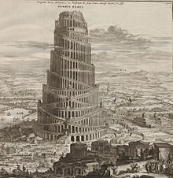

```{r, echo = FALSE}
knitr::opts_chunk$set(echo = TRUE)
```


## Data babel




## Data babel


### Diversity 

- Diversity in content (the questions asked and answers collected)
- Diversity in form (the coding of those questions and answers)

### Why

- Many verbal autopsy datasets do not conform fully to the international standards of the time of creation
- Those very standards have changed over time

## VIDA

```{r, echo = FALSE, eval = TRUE}
df <- data_frame(country = c(rep('Mali', 2),
                             rep('Gambia', 3),
                             rep('Kenya', 4)),
                 standard = c('2007 WHO VA form',
                              '2016 WHO VA form',
                              'INDEPTH Network VA form',
                              '2012 WHO VA form',
                              '2016 WHO VA form',
                              'Customized INDEPTH form',
                              'WHO SAVVY form',
                              '2007 WHO VA form',
                              '2012 WHO VA form'),
                 start = c(2000, 2017, 
                           2008, 2013, 2017,
                           2002, 2007, 2009, 2013),
                 end = c(2017, 2018,
                         2013, 2017, 2018,
                         2007, 2009, 2013, 2018)) %>%
  mutate(country_number = as.numeric(factor(country)))


cols <- colorRampPalette(brewer.pal(n = 9, 'Spectral'))(length(unique(df$standard)))
ggplot(data = df) +
  geom_segment(aes(x = start,
                 y = country,
                 xend = end,
                 yend = country,
                 color = standard),
               size = 10) +
  scale_color_manual(name = 'Standard',
                     values = cols) +
  theme_bw() +
  labs(x = 'Year',
       y = '')
```
